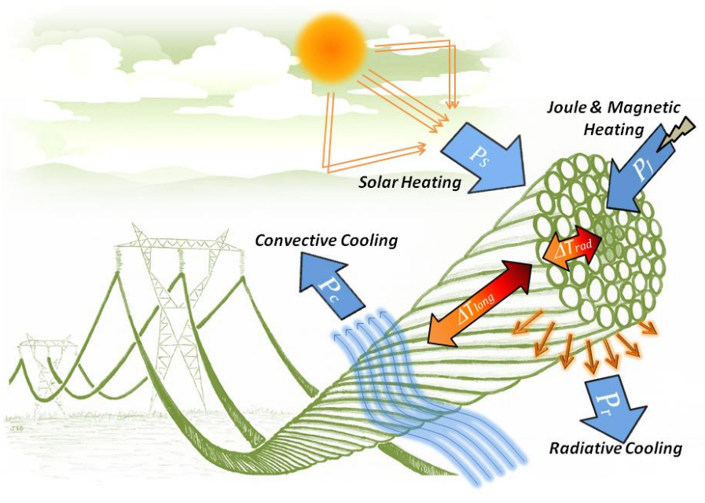

<!--
SPDX-FileCopyrightText: 2025 RTE (https://www.rte-france.com)

This Source Code Form is subject to the terms of the Mozilla Public
License, v. 2.0. If a copy of the MPL was not distributed with this
file, You can obtain one at http://mozilla.org/MPL/2.0/.
SPDX-License-Identifier: MPL-2.0
-->

# ThermOHL

Temperature estimation of overhead line conductors is an important topic for 
TSOs for technical, economic, and safety-related reasons (DLR/ampacity, sag 
management ...). It depends on several factors, mainly transit, weather and the
conductor properties. ThermOHL is a python package to compute temperature and/or 
ampacity in overhead line conductors.

## Features

The temperature of a conductor is estimated by solving a heat equation
which describes how temperature evolves over time, taking into account
different power terms that either heat or cold the conductor (see next picture 
from CIGRE[@CIGRE]).

Two heat equations (a more complete, third one is under development)
are available:

* one with a single temperature for the cable;
* another with three temperatures (core, average and surface
  temperature) for more precise computations.

Each of these equations can be used with a set of pre-coded power
terms from the literature :

* one using CIGRE recommendations [@CIGRE];  
* one using the IEEE standard [@IEEE];  
* two others from RTE departments.

Solvers derivated from heat equations can compute steady-state
temperature or ampacity, and transient temperature. The set of
[parameter](api-reference/parameters.md) required depends on the 
power terms used, and default values are provided.

## References
